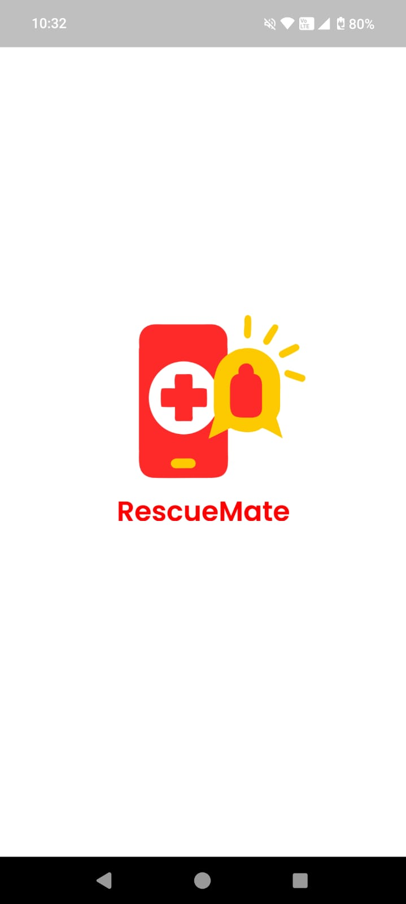
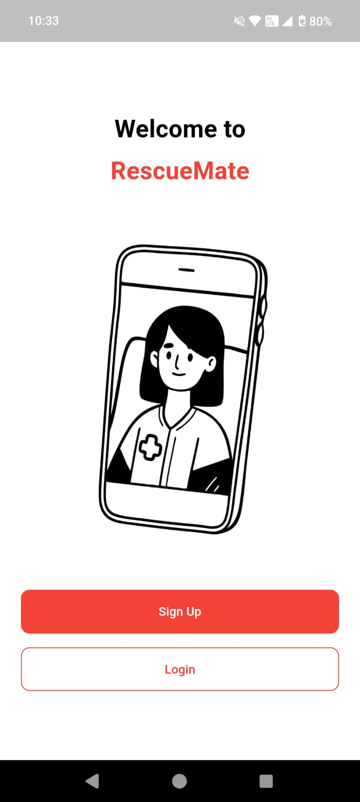
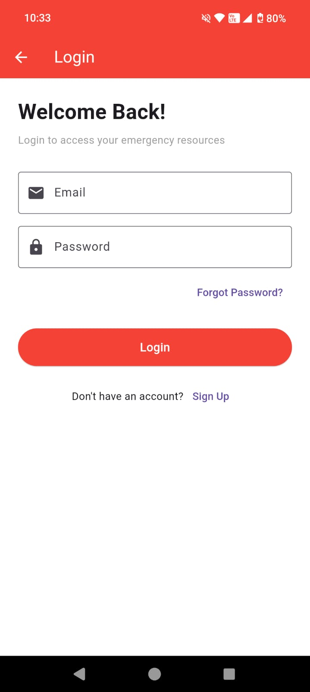
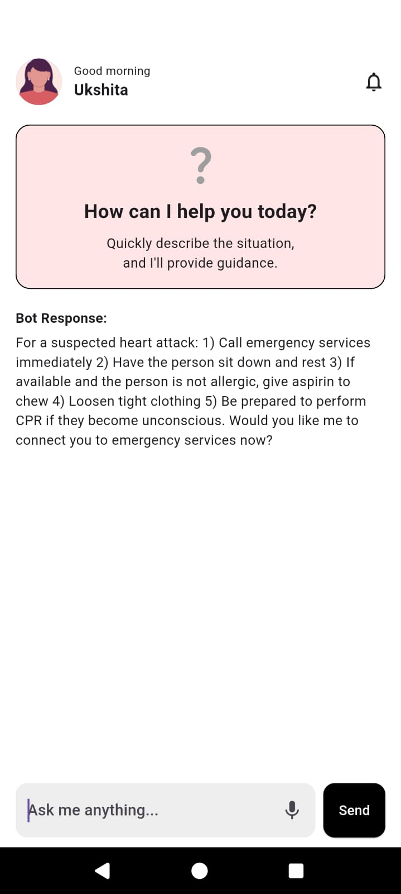
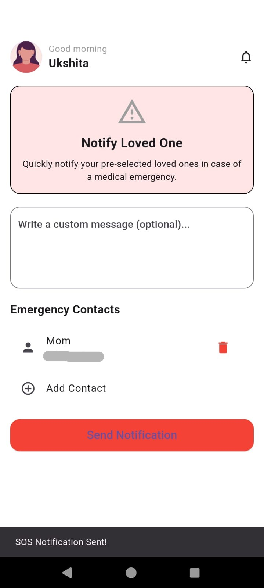
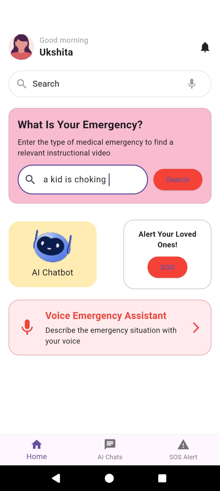
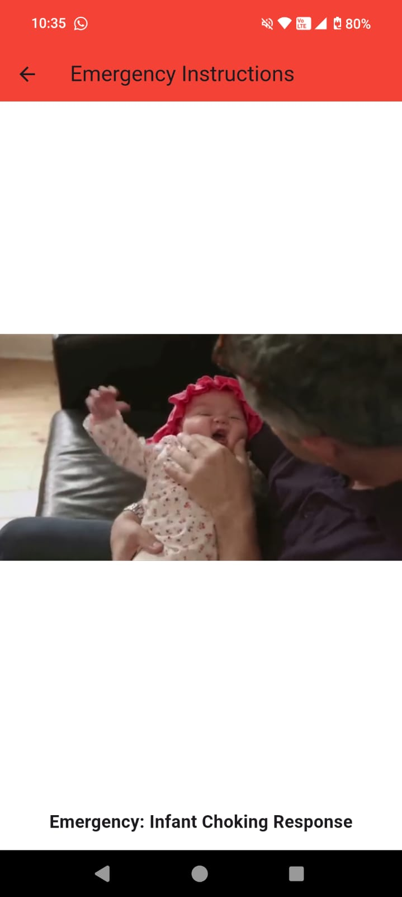
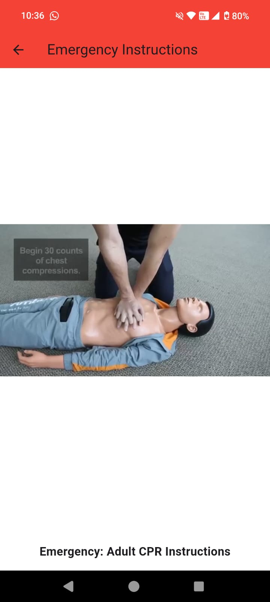
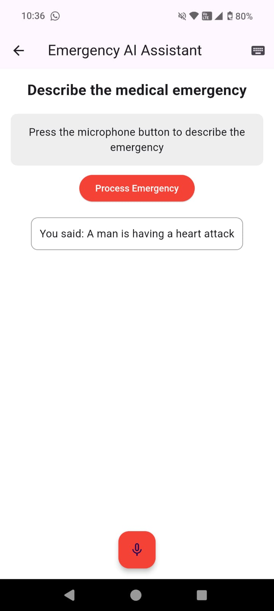

# Emergency App

A Flutter mobile application designed to assist users during emergencies by providing quick access to essential services and information, powered by AI and real-time location features.

## Problem Statement

During emergency situations, bystanders often lack the knowledge or confidence to provide appropriate assistance to victims. Key challenges include:

1. **Lack of immediate medical knowledge**: Most people are not trained in first aid or emergency response.
2. **Confusion about symptoms**: Bystanders struggle to identify symptoms and determine the appropriate course of action.
3. **Delayed professional help**: Critical time is lost while waiting for emergency services to arrive.
4. **Communication barriers**: Difficulty in effectively communicating the emergency situation and location to emergency services.

The Emergency App addresses these challenges by empowering users with AI-guided assistance, instructional content, and rapid emergency contact features, potentially saving lives in critical situations when every second counts.

## Features

1. **AI Chatbot**  
   An intelligent chatbot powered by Dialogflow to understand the user's condition through symptom-based conversation and provide relevant emergency advice or guidance.

2. **Video Assistance for Medical Emergencies**  
   Plays instructional videos tailored to the specific emergency—for example, different CPR videos for kids, men, and women to ensure inclusivity and accuracy.

3. **SOS System**  
   - Sends an SMS containing the user's current location to saved emergency contacts.
   - Alerts nearby ambulance services to ensure faster response in critical situations.
   - One-tap emergency calling to local emergency numbers.

4. **Emergency Information Repository**
   - First aid guides for common emergencies
   - Location-based emergency service contacts
   - Offline access to critical information

## Tech Stack

- **Frontend**: Flutter for cross-platform mobile development
- **AI Integration**: Dialogflow for natural language processing and chatbot capabilities
- **Location Services**: Geolocator for precise location tracking
- **Data Storage**: Shared Preferences for local storage of emergency contacts

## Screenshots

  <div style="display: flex; flex-wrap: wrap; gap: 10px;">
    <!-- Example with 500px width - images will display side by side where space allows -->
    
    
     
     
     
     
     
     
     
     
  </div>


## Installation

1. **Clone the repository**:
   ```bash
   git clone https://github.com/manvip28/emergency_app.git
   ```

2. **Navigate to the project directory**:
   ```bash
   cd emergency_app
   ```

3. **Install dependencies**:
   ```bash
   flutter pub get
   ```

4. **Run the app**:
   ```bash
   flutter run
   ```

## Dependencies

- `flutter`: Core framework for building the application
- `geolocator`: For accessing device location
- `permission_handler`: To manage app permissions
- `just_audio`: For playing audio alerts
- `url_launcher`: For making calls and sending SMS
- `http`: For API communication
- `shared_preferences`: For local data storage
- `dialogflow_flutter`: For integrating Dialogflow AI chatbot
